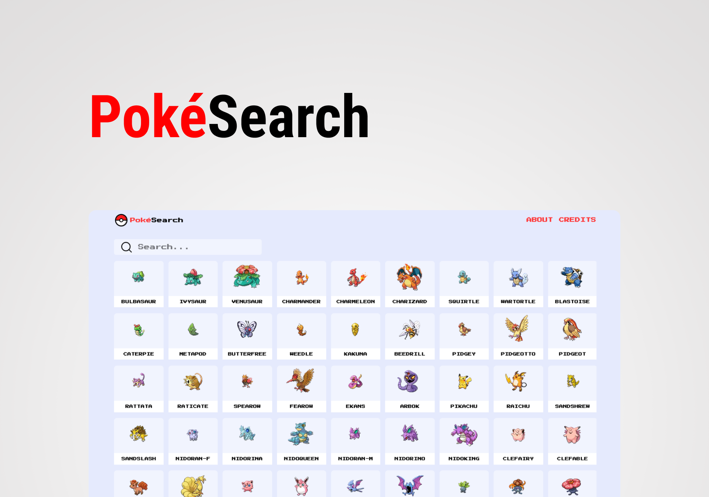

<h1 align="center">
    PokéSearch
</h1>

<p align="center">
  <a href="#-tech">Tech</a>&nbsp;&nbsp;&nbsp;|&nbsp;&nbsp;&nbsp;
  <a href="#-project">Project</a>&nbsp;&nbsp;|&nbsp;&nbsp;&nbsp;
  <a href="#-run">Run</a>&nbsp;&nbsp;|&nbsp;&nbsp;&nbsp;
  <a href="#-extras">Extras</a>&nbsp;&nbsp;
</p>

<p align="center">
  
</p>

----
## 📂 Tech Pack

This project has been developed with:

- [React](https://reactjs.org)
- [TypeScript](https://www.typescriptlang.org/)
- [StyledComponents](https://styled-components.com/)
- [Next](https://nextjs.org/)
- [Axios](https://axios-http.com/docs/intro)

----
## 🚀 Project

A Pokémon list where user can look for a specific pokémon or just scroll through all of them. It is also possible to see details from a pokémon when clicking in one of them.

----
## ⏩ Run

This project can be executed this way

1 - First, you must install dependencies

```bash
# ./pokesearch
npm i
# or
yarn
```

2 - You should run the development server
```bash
npm run dev
# or
yarn dev
```

3 - Then, you can access it through http://localhost:3000/

### 🔎 Extras

The aim of this project was to practice developing in general, but mainly for knowing how things such as Infinite Scrolling and Skeleton Loading works. 

----

